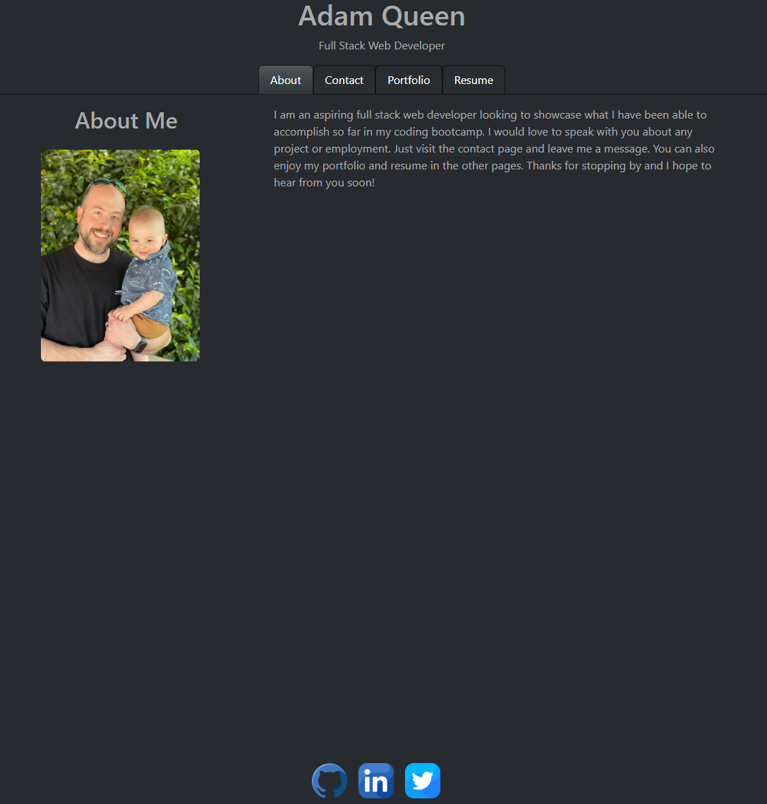

# Adam Queen's React Portfolio

  ## Table of Contents
  - [Description](#description-of-project)
  - [Questions](#questions)
  - [Visuals](#visuals)
  - [Link to deployed portfolio](#link-to-deployed-portfolio)
  
  ## Description of project
  
  This was my first attempt making a full ReactJS portfolio site from scratch. Coming from Handelbars this is a much better system in my opinion and can see why this library is in such high demand.  I plan to continue to update this after my coding bootcamp is over to include our final team project as well as any other project I do afterwards. I will admit the styling is rough right now but I have a feeling after class is over in 5 days I will have time to finish and polish it for job application needs.
  
  ## Questions
  
  If you have any questions about this project, please feel free to email me at smoke5643@gmail.com or on Github at https://www.github.com/Smoke5643. I will do my best to get back to you as soon as possible!

  ## Visuals

Preview of React Portfolio:

## Link to deployed portfolio

https://smoke5643.github.io/adam-react-portfolio/